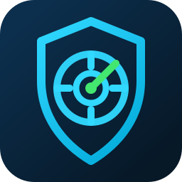

# NetScope Scanner



NetScope Scanner est une application Windows Python de scan et d'analyse réseau. Elle accepte une adresse IPv4 ou une plage CIDR autorisée, détecte les ports TCP ouverts, tente d'identifier les services et versions, puis associe des CVE potentielles uniquement lorsqu'un produit ou une version est disponible.

Un port ouvert ne suffit jamais à confirmer une vulnérabilité. Le flux appliqué est :

`IP -> port ouvert -> service -> produit -> version -> CPE -> CVE potentielle -> niveau de confiance`.

## Architecture

- `main.py` : point d'entrée et configuration du journal local.
- `ui/` : interface CustomTkinter, tableau scrollable, filtres CVE, détail au double-clic, journal temps réel.
- `scanner/` : validation de cible, scan TCP concurrent, détection service/version, Nmap optionnel.
- `vulnerability/` : CPE, client NVD 2.0, CISA KEV, cache SQLite, matching CVE.
- `config/ports.py` : ports, services, risques, descriptions et recommandations.
- `config/settings.py` : paramètres persistants et recommandations par défaut.
- `database/` : historique SQLite et tables additionnelles services/CVE.
- `reports/` : exports PDF et Excel enrichis.
- `services/` : profils rapide, standard et personnalisé.
- `tests/` : tests unitaires sans requête vers l'API NVD réelle.

## Installation Windows

```powershell
cd "D:\NetScope Scanner"
python -m venv .venv
.\.venv\Scripts\Activate.ps1
python -m pip install --upgrade pip
pip install -r requirements.txt
```

## Lancement

```powershell
cd "D:\NetScope Scanner"
python main.py
```

## Modes de scan réseau

L'interface propose maintenant plusieurs modes :

- `Ma machine` : remplit la cible avec l'adresse IPv4 de l'interface sélectionnée.
- `Une adresse IP` : analyse une adresse unique.
- `Tout mon réseau local` : détecte l'interface active, le masque, la passerelle et remplit le CIDR local.
- `Une plage CIDR` : analyse une plage autorisée, limitée par défaut à `/24`.
- `Liste d'adresses IP` : accepte une liste comme `10.10.10.1,10.10.10.2`.
- `Ping uniquement` : découvre les équipements sans scanner les ports.
- `Découverte rapide` / `Rapide` / `Standard` / `Personnalisé` / `Scan complet` : contrôlent la profondeur de l'analyse.

Boutons principaux :

- `Détecter mon réseau` remplit la cible avec le CIDR local détecté, sans lancer le scan.
- `Découvrir` affiche les appareils progressivement via ARP, ICMP, TCP rapide et table ARP.
- `Lancer le scan` analyse les ports selon le profil choisi.
- `Arrêter` demande une annulation coopérative.
- `Actualiser` recharge les interfaces réseau actives.

Le mode personnalisé accepte :

```text
22,80,443
1-1024
22,80,443,8000-8100
```

Le mode `Scan complet` teste les ports `1` à `65535` et demande confirmation, car il peut être très long.

## Paramètres

La page `Paramètres` permet de modifier les valeurs opérationnelles :

- workers
- timeouts découverte/TCP/bannière
- tentatives
- fréquence de rafraîchissement UI
- limite d'hôtes
- durée du cache CVE
- mode hors ligne CVE
- activation optionnelle de Nmap
- dossier de rapports
- rétention de l'historique

Les paramètres sont stockés dans :

```text
%USERPROFILE%\NetScope Scanner\settings.json
```

## CVE, NVD et mode hors ligne

NetScope utilise l'API officielle NVD 2.0 quand un CPE peut être généré. La clé API est facultative :

```powershell
$env:NVD_API_KEY="votre-cle"
python main.py
```

La clé n'est jamais stockée dans le code, SQLite, les journaux ou les rapports. Les réponses NVD et CISA KEV sont mises en cache localement. Si Internet est indisponible, l'application continue le scan réseau et utilise le cache disponible.

Nmap est optionnel. Si activé dans le code via `ScannerSettings(enable_nmap=True)` et présent dans le PATH, NetScope utilise une commande sûre avec arguments séparés, proche de `nmap -sV --version-light -Pn -p PORT IP`, sans script d'exploitation.

## Tests

```powershell
cd "D:\NetScope Scanner"
python -m pytest -q
```

Les tests utilisent `localhost`, des mocks et des réponses JSON simulées. Ils ne lancent pas de scan Internet et n'interrogent pas l'API NVD réelle.

## Mesure de performance contrôlée

```powershell
@'
import time
from scanner.engine import NetworkScanner
from scanner.models import ServiceFingerprint

class Detector:
    def detect(self, host, port):
        return ServiceFingerprint(product="TestService", version="1.0", confidence="Probable")

class Matcher:
    def match(self, fp):
        return []

scanner = NetworkScanner(timeout=0.01, max_workers=64, service_detector=Detector(), cve_matcher=Matcher())
scanner._scan_port = lambda host, port: port % 2 == 0
start = time.perf_counter()
summary = scanner.scan("127.0.0.1", range(1, 201))
elapsed = time.perf_counter() - start
print(f"{200 / elapsed:.1f} ports/s, {summary.open_port_count} ports ouverts simulés")
'@ | python -
```

## Création d'un exécutable Windows

```powershell
cd "D:\NetScope Scanner"
pip install pyinstaller
pyinstaller --noconfirm --onefile --windowed --name "NetScope Scanner" --icon "assets/netscope.ico" --add-data "assets/netscope.ico;assets" main.py
```

L'exécutable sera généré dans :

```text
D:\NetScope Scanner\dist\NetScope Scanner.exe
```

## Sécurité d'utilisation

Utilisez uniquement NetScope Scanner sur vos propres réseaux ou sur des réseaux pour lesquels vous disposez d'une autorisation explicite. L'application ne fait ni brute force, ni exploitation, ni contournement d'authentification.

Avant chaque découverte ou scan, cochez `Analyse autorisée`. Les cibles publiques déclenchent un avertissement supplémentaire. L'interface limite par défaut une opération à 256 hôtes afin d'éviter les scans involontaires trop larges.

La fiche d'un appareil propose aussi un `Ping continu` avec paquets envoyés/reçus, perte et latences min/moy/max.

Les rapports peuvent être exportés en PDF, Excel et CSV.

Documents de validation :

- `docs/SECURITY_MODEL.md`
- `docs/VALIDATION.md`
